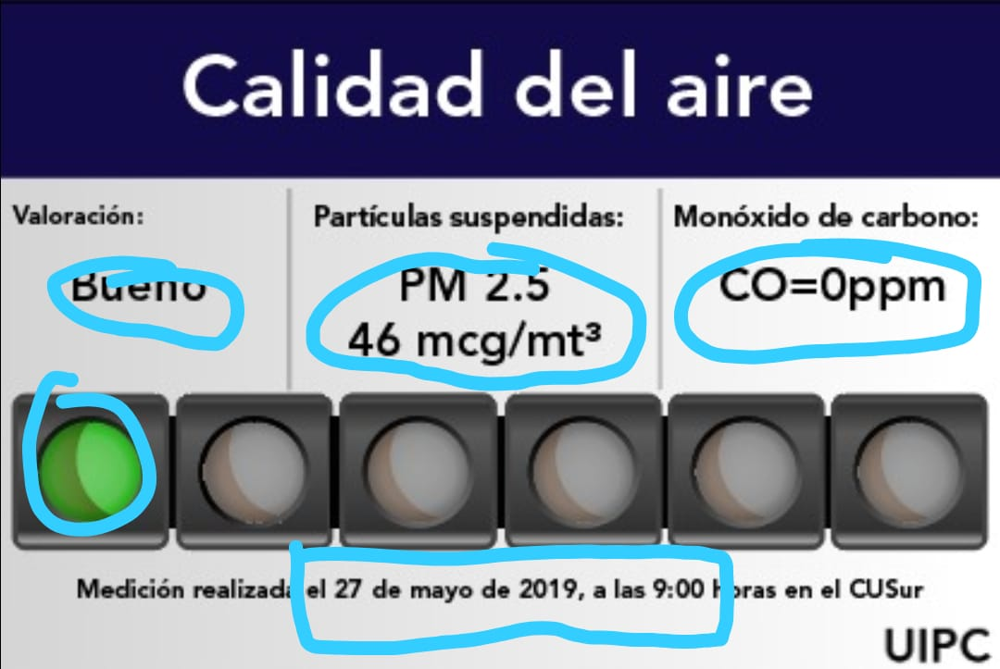

# Widget

[](https://app.codeship.com/projects/347345)



This is the repo for the info-widget app that is displaying on the cusur's web page.

## Context

On the [Cusur Website](http://www.cusur.udg.mx/) they want to display a component that will render the air quality each day.

The component should get the information updated from a database that will need to be administrable from another app.

This repo holds this two apps.

### Widget component

* the file `widget.php` has all the code that renders the component (via ajax)

* it exports a function that recieves the dom element where the component should be mounted.

### Widget admin
> Admin system for the widget

## Development

First clone the project:

```bash
git clone
```

Then create a `.env` file with the following content:

```
SECRET_KEY=<generated_key>
DEBUG=True
ADMIN_NAME=<chris>
ADMIN_EMAIL=<email>
REDIS_URL=redis://127.0.0.1:6379/1
CACHE_TTL=10
```

> You need to have redis running locally

I strongly recommend use [virtual environments]().

Create your venv:

```bash
python -m venv .venv
```

Activate the venv:

```bash
source .venv/bin/activate
```

Now you can safely install the dependencies listed on `requirements.txt`:

```bash
$venv > pip install -r requirements.txt
```

Run the migrations:

```bash
$venv > python manage.py migrate
```

You'll need to create a `superuser`:

```bash
$venv > python manage.py createsuperuser
```
> Enter the username and password

Run the development server:

```bash
$venv > python manage.py runserver
```

Go to `localhost:8000/admin` and enjoy!


## Database structure

**Models**

| Name     |                          Fields                         |
|----------|---------------------------------------------------------|
| Event    | `name`, `is_active`, `level`, `created_at`, `updated_at`|
| User     | `django-admin-user`                                     |
| Measure  | `name`, `value`, `event_id`, `created_at`, `updated_at` |


## Usage

The `admin` system will serve the needed views so the admin is able to manage the `event` and the `measurements` as needed.

There's an endpoint from the `admin` that return you the active event and the latest measurment for that event:

```
GET /widget/agent
```